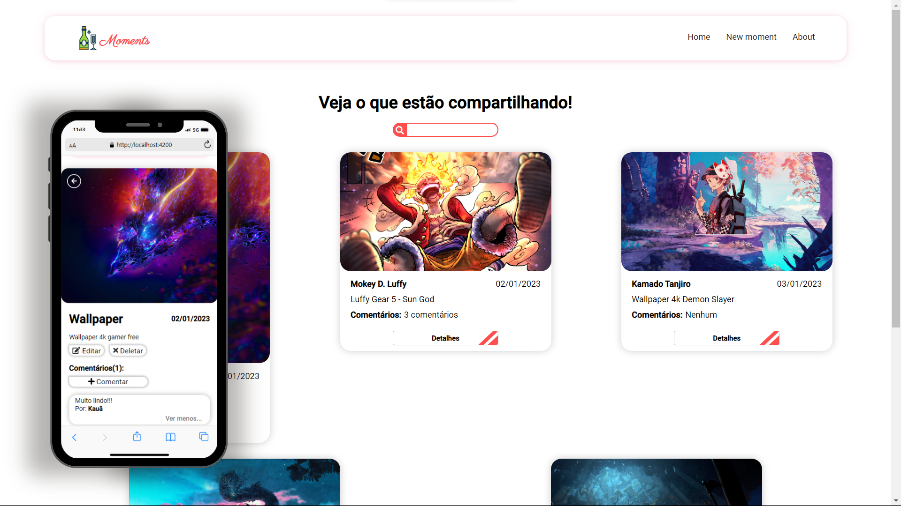
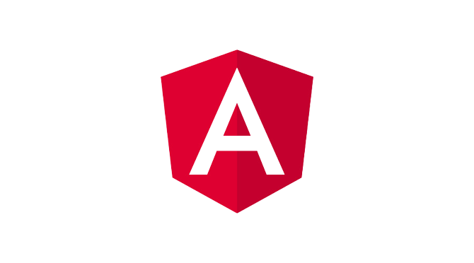

    <h1 style="text-align: center"><strong>Moments</strong></h1>
    

        
    

    

        <h3><strong>Sobre o projeto:</strong></h3>
        
Projeto de finalização de curso de <strong>Angular</strong> realizado por <i>Matheus Battisti</i> do canal <i>Hora de Codar</i> que consiste numa aplicação de puplicação de momentos, essa que se comunica com um banco de dados por meio de uma API tendo todo o sistema CRUD feito tendo, também, o sistema de comentários.

    

    

        <h2><strong>Tecnologias:</strong></h2>
        <ul>
            <li>Angular 13</li>
        </ul>
    

